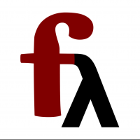

What is Frege? 
==============

[](https://travis-ci.org/Frege/frege)
[](https://gitter.im/Frege/frege?utm_source=badge&utm_medium=badge&utm_campaign=pr-badge&utm_content=badge) **Winner of the JavaOne Emerging Languages Bowl 2015, 2016, 2017**



Frege is a Haskell for the JVM.

Like any Haskell, it is purely functional, 
enjoys a strong static type system with global type inference and
[non-strict](http://en.wikipedia.org/wiki/Non-strict_programming_language) - also known as _lazy_ - evaluation.

Frege compiles to Java, runs on the JVM, and uses any Java library you want. 
It can be used inside any Java project.

A Taste of Frege
----------------

**1. Hello World**

This is the classic starter with a slight extension to show the fluent usage from Java and the benefits
of having a type system that can recognize purity.

```frege
module Hello where

greeting friend = "Hello, " ++ friend ++ "!"

main args = do
    println (greeting "World")
```

This code will compile to `Hello.class` and `Hello.java` with a regular Java `main` method that one can start the usual Java way.

Moreover, the `Hello.class` will have a method

    public static String greeting(String ...) {...}

that one can call from Java or any other JVM language.

The `greeting` function is **pure**, meaning it is _stateless_ and _free of side effects_.
Therefore, it is _threadsafe_ and its results may be _automatically cached_ since given the same argument, the result will always be the same.

The `main` function is **impure**. It takes a list of `String`s and does not return just "void" as in most other JVM languages but the
type `IO ()`, telling that it may produce side effects like printing to the console. The Frege **type system** guarantees
that any caller of `main` must also be of some `IO` type and is thus also marked as impure. That way, the lack of purity percolates up the whole call chain.

"Hello World" already shows the tenet of _"islands of purity"_ (greeting) in a _"sea of imperative code"_ (main).

Since the purity information is carried through the **type system**, the compiler can potentially use it for many
**optimizations** such as pre-calculation, deferred execution, parallel execution, caching, and elimination of common subexpressions.

> Frege is **strongly** and **statically** typed, even though we haven't declared any types in the code above.
> If not declared, the types are _inferred_. When declared, the given types are checked against the inferred ones.

**2. Expressive code**

Much can be achieved in Frege in one line of code and here is an example that you can paste into the
[Online REPL](http://try.fregelang.org/). It calculates [pythagorean triples](https://en.wikipedia.org/wiki/Pythagorean_triple) below `10` with the help of a list comprehension:

    [ (x,y,z) | x <- [1..10], y <- [x..10], z <- [x..10], x*x + y*y == z*z ]
    
After execution, you should see a list of triples containing the solutions `(3, 4, 5)` and `(6, 8, 10)`. 
    
Such a comprehension reads almost like an SQL statement: 
* _select_ the triple `(x,y,z)`
* with `x` drawn _from_ the list of `1` to `10`, `y` from `x` to `10`, and `z` from `x` to `10`
* _where_ `x*x + y*y == z*z`

> There are much more elegant and efficient ways to calculate the triples, but those are a bit less obvious.

**3. No mutable state**

Mutable state is the source of many bugs and makes code less modular. 
Frege allows interesting ways to avoid it.
That style is very unfamiliar to many developers that come from the imperative world.
Be brave. It is different but there are a huge benefits to be discovered.

Let's go for a more advanced example where we calculate the fixpoint of the cosine function, i.e. the
value where [`cos(x) == x`](http://www.wolframalpha.com/input/?i=cos+0.7390851332151607).

Implementations in imperative languages usually involve introducing local mutable state. Not so in Frege:
```frege
import frege.prelude.Math (cos)

cosines = iterate cos 1.0
pairsOf xs = zip xs (tail xs)
head [ x | (x,y) <- pairsOf cosines, x == y] 
```
After execution, it should show you the value

     0.7390851332151607

The code is most likely incomprehensible for a Frege/Haskell newcomer at first, but it becomes
less intimidating once you know the parts. With a bit of experience, you may even find it
clear and obvious.
* Again, we have a list comprehension. We get a list of `x` values, but we only need the first element, the `head`.
* The `x` comes from an `(x,y)` pair where `x == y`.
* The `(x,y)` pair is drawn from a list of pairs of cosine values.
* The `cosines` are an _infinite_ list of values that starts with `1.0` and then `iterate`s to `cos(1.0)`, `cos(cos(1.0))`, `cos(cos(cos(1.0)))`, and so forth.
* Please note that the `=` signs do _not_ denote an assignment but a definition. There are no assignments in Frege!
* The `pairsOf` function works on any list of values to create pairs of any adjacent values.
It uses `zip`, which is an often-used construction for this task, but the details are not relevant here.

This code is **pure**. The inferred type is `Double`.
The code does not rely on any mutable state (not even internally). Therefore it is _threadsafe_ and the result can be _automatically cached_.

What's in it for me?
--------------------

**For the Java programmer**

Frege offers you the opportunity to **learn and use a new programming paradigm**
that shines with
* a solid mathematical foundation,
* **pure** functions,
* **immutability** by default,
* side-effects only when declared,
* **robustness** under composition and concurrency,
* and a **type system** that is unparalleled on the JVM with its combination of power, simplicity and expressiveness.

You can still reuse your existing knowledge of the Java platform and its vast set of libraries.
Frege interoperates with Java such that you can easily
[call Frege from Java code](https://github.com/Frege/frege/wiki/Calling-Frege-Code-from-Java) and vice versa.
But unlike other approaches,
[calling Java from Frege](http://mmhelloworld.github.io/blog/2013/07/10/frege-hello-java/)
doesn't undermine the language guarantees.

> When calling Java from Frege, you have to declare the Java types in rigid Frege terms in order to
> preserve the Haskell language characteristics, especially purity, thread safety, and lazy evaluation.

Learning Frege essentially means that **you will also learn Haskell** and thus your effort pays off twice, since
you also get to know a very popular non-JVM language with 25+ years of development, a great community,
many (free) books, publications, tutorials, online courses, and considerable industry demand.


**For the Haskell programmer**

Frege gives you the opportunity to **use your skills on the JVM**.
Most idiomatic Haskell code will run in Frege unmodified or with only minimal, obvious adaptations.
Even more important: you can bring your purely functional solution strategies to your Java projects.

From now on you can also enjoy on the JVM:
* the terse Haskell syntax
* pure functions and lambdas
* algebraic data types and **typeclasses** with parametric polymorphism
* powerful type inference
* **higher rank types**
* lazy evaluation on infinite data structures
* pattern matching, list comprehensions, do-notation, point-free style, operators, modules
* functors, monoids, semigroups, monads, and all your other beloved mathematical abstractions.

Frege aims at compiling most "vanilla" Haskell code that has no external dependencies "as is"
or with only minimal, obvious changes. Likewise, Frege code that makes no use of JVM specifics should
easily run through other Haskell compilers. We are currently in the progress of coming closer to this goal
by ironing out insubstantial differences. 

The Name
--------

The Frege programming language is named after and in honor of Gottlob Frege
who published the ideas of higher-order functions, partial function application, and many more concepts of formal logic
that we now take for granted back in the 19th century.

If you are curious how this name is pronounced, [you can use this translator page](http://translate.google.de/#de/en/Frege) to get it right.
Just click the audio symbol in the left (german) part.

Project State
-------------

The compiler, an Eclipse plugin, and a provisional version of the documentation can be [downloaded](https://github.com/Frege/frege/releases). 
Note that Frege requires at least JDK 7 to compile and run programs.

A number of tools are **written in Frege**:
* the Frege compiler itself,
* the Frege [standard library]( http://www.frege-lang.org/doc/frege/Prelude.html),
* the Frege [command-line REPL](https://github.com/Frege/frege-repl),
* the Frege web-based, full-stack [interactive online REPL](http://try.fregelang.org/),
* the [FregeFX REPL](https://github.com/Dierk/frepl-gui/blob/master/README.adoc) - a JavaFX view on the REPL,
* the Frege [Eclipse plugin](https://github.com/Frege/eclipse-plugin), 
* and the documentation tool.

This should speak for itself regarding stability, functional completeness and performance of the language.

The documentation is provisional, and the library supports almost all of the Haskell 2010 standard library
with the remaining [known differences](https://github.com/Frege/frege/wiki/Differences-between-Frege-and-Haskell)
being there for good reason.

See the [Getting Started](https://github.com/Frege/frege/wiki/Getting-Started) page for 
getting started at the command-line or read the [Eclipse plugin](https://github.com/Frege/eclipse-plugin) page.
You can develop [Frege inside Intellij IDEA](https://github.com/Frege/frege/wiki/Using-Frege-in-Intellij-IDEA) with an
Intellj IDEA plugin being under [active development](https://github.com/psurkov/intellij-frege)
and there is build automation support for
Maven, Gradle, Leiningen, SBT, and Bazel.

The awesome QuickCheck library for advanced unit testing comes bundled with the language.

Related Projects
----------------

* [Hoogle for Frege (currently disabled due to domain issues)](http://hoogle.haskell.org:8081/), a Frege API search engine, by Neil Mitchell and Marimuthu Madasamy
* The REPL projects, consisting of [core JSR 223 scripting support](https://github.com/Frege/frege-interpreter), [interface for the command-line](https://github.com/Frege/frege-repl) and [online REPL](http://try.fregelang.org), all written and maintained by Marimuthu Madasamy, and the [FregeFX REPL](https://github.com/Dierk/frepl-gui/blob/master/README.adoc) with a JavaFX view by Dierk König
* Support for [web applications and web services](https://github.com/Frege/frege/wiki/Frege-for-Web-Applications) 
* [Maven Compiler Plugin for the Frege language](https://github.com/Frege/frege-maven-plugin), by Mark Derricut 
* [Frege compiler/library as an OSGi bundle](https://github.com/talios/frege-bundle), by Mark Derricut 
* [Apache Maven Tile for the Frege Programming Language](https://github.com/talios/frege-maven-tile), by Mark Derricut
* [A Leiningen plugin to compile Frege code](https://github.com/Frege/frege-lein-plugin), by Sean Corfield
* [Gradle Frege plugin](https://github.com/Frege/frege-gradle-plugin), by Mark Perry and Dierk König
* [Real World Frege](https://github.com/Dierk/Real_World_Frege/), by Dierk König
* [sbt Frege plugin](https://github.com/earldouglas/sbt-frege), by James Douglas
* [An efficient Frege Ray-Tracer](https://github.com/mchav/Frege-RayTracer), by Michael Chavinda
* [Frege Chat](https://github.com/Dierk/FregeChat), Winner at JavaOne 2016 language competition, Dierk König
* [ProB Parser Library](https://github.com/bendisposto/probparsers) by Markus Brenneis (@mabre) and Jens Bendisposto (editor), University Düsseldorf
* [Conduit in Frege](https://github.com/matil019/frege-conduit) a port of the Haskell conduit library.

Contributions
-------------

If you are interested in contributing, here are some hot topics:

* Write Frege code to support more of the Java API.
* Port Haskell [libraries](https://github.com/Frege/frege/wiki/Libraries) or tools.
* Open issues in the issue tracker if you find bugs, errors in documentation, etc.
* [Open issues](https://github.com/Frege/frege-gradle-plugin/issues) in the tooling like [this one](https://github.com/Frege/frege-gradle-plugin/issues/41)
* Help make Frege popular by writing code for projects like [Rosetta Code](http://rosettacode.org/wiki/Rosetta_Code), or [PLEAC](http://pleac.sourceforge.net).
* Contribute to the related projects mentioned above, or make your own.

Contact
-------

**Meet Frege friends in person**

Talk to us at any of the [upcoming events](https://github.com/Frege/frege/wiki/Talks)
or view historic [presentation slides and videos](https://github.com/Frege/frege/wiki/Talks#historic)!

**For discussions**

You can contact the project members through the
[discussion group](http://groups.google.com/group/frege-programming-language)
devoted to the Frege programming language.

**For questions**

Specific programming problems are best solved on
[Stack Overflow](http://stackoverflow.com/questions/tagged/frege),
we check questions tagged "frege" on a regular basis.

**For casual chat (and quick questions)**

There's a #frege channel on [Freenode IRC](https://freenode.net) where
some project members and Frege users hang out. You can use any IRC client
you like or Freenode's [WebChat interface](https://webchat.freenode.net)
if you don't want to install IRC software.

The [Frege Gitter channel](https://gitter.im/Frege/frege) is also a way
tool to connect to the community.

**Staying up to date**

* [YouTube playlist](https://www.youtube.com/watch?v=S-4sYwGY3Sk&list=PL14crhrjkk-lbdn4Yg85_QRk9r_uiX1yh)
* Twitter: [@fregelang](https://twitter.com/fregelang)
* Facebook: [fregelang](https://www.facebook.com/fregelang)
* Reddit: [/r/frege](https://www.reddit.com/r/frege)

**For issues only**

If you find a bug or have an idea for enhancements, please let us know by opening an issue in the
[issue tracker](https://github.com/Frege/frege/issues).
(You'll need a GitHub account to do this.)
_Please keep discussions to the [forum](http://groups.google.com/group/frege-programming-language)
and questions to [Stack Overflow](http://stackoverflow.com/questions/tagged/frege)._

Links
-----

* [Frege Wiki](https://github.com/Frege/frege/wiki/_pages)
* [Language reference](http://www.frege-lang.org/doc/Language.pdf)
* [InfoQ Article on Frege's history, current state, and future plans](http://www.infoq.com/news/2015/08/frege-haskell-for-jvm)
* [Author's Blog (currently discontinued due to legal uncertainty)](https://fregepl.blogspot.com/), [Dierk's Blog](http://www.canoo.com/blog/tag/frege/)
* [edX Functional Programming course FP101x](https://www.edx.org/course/introduction-functional-programming-delftx-fp101x-0) with exercises in Frege
* Functional Programming [13 videos](https://www.youtube.com/playlist?list=PLoJC20gNfC2gpI7Dl6fg8uj1a-wfnWTH8) by Dr. Erik Meijer
* [](http://dierk.gitbooks.io/fregegoodness)Introduction to Frege: [video](https://www.parleys.com/play/543fa326e4b06e1184ae41e6/chapter44/about), [slides](http://de.slideshare.net/Mittie/frege-purely-functional-programming-on-the-jvm)
* The [Frege Goodness](http://dierk.gitbooks.io/fregegoodness) free ebook 

Recommended reading

* [John Hughes: Why functional programming matters](http://www.cs.kent.ac.uk/people/staff/dat/miranda/whyfp90.pdf)
* [Book: Haskell Programming from first principles](http://haskellbook.com) with [book examples in Frege](https://github.com/elrocqe/frege_programming)
* [Book: Real-World Haskell](http://book.realworldhaskell.org/read/) (free online)
* [Book: Learn you a Haskell](http://learnyouahaskell.com/chapters) (free online)
* [Book: Programming in Haskell](http://www.amazon.com/Programming-Haskell-Graham-Hutton/dp/0521692695/)

API Docs
--------

* [Online Docs (Frege Standard Library)](http://www.frege-lang.org/doc/fregedoc.html)
* [Online Docs (Runtime Javadoc)](http://www.frege-lang.org/doc/index.html)

Copyright and License
---------------------

Copyright (c) Ingo Wechsung, 2011-2021. All rights reserved.
The use and distribution terms for this software are covered by the
[BSD 3-clause license](http://opensource.org/licenses/BSD-3-Clause)
which can be found in the file LICENSE.txt at the root of this distribution.
By using this software in any fashion, you are agreeing to be bound by the terms of this license.
You must not remove this notice, or any other, from this software.
